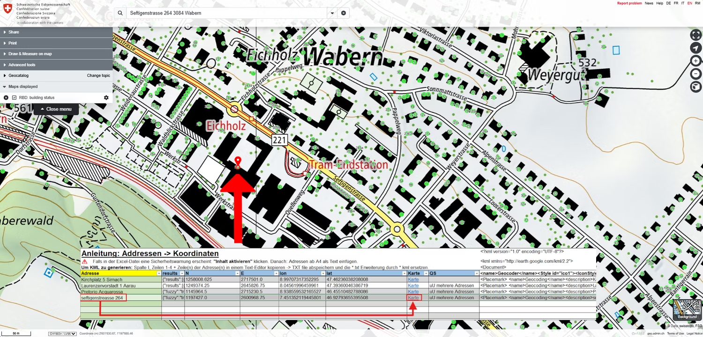

# Easily generate the coordinates of addresses in Switzerland and display them on map.geo.admin.ch

Would you like to easily calculate the address details of your family, your class, your team or association, your customers or any other group, and display the corresponding points on a map? You can do it with a simple Excel file.

---

<a id="link-with-icon" href="https://backend.geo.admin.ch/fileservice/sdweb-docs-prod-geoadminch-files/files/2025/01/15/0e4d7b2c-fa4c-4623-949b-ca11546856cd.xlsx">

Geocoder
</a>

Excel Datei die Koordinaten aus Adressen generiert

**XLSX**  |  **510.04 kB**  |  **15. Januar 2025**

---

- Download the XLSX file - Geocoder (only available in German)
- **Warning**: Follow the instructions in the Excel file:

  1. If a security warning appears in the Excel file: click on "Activate content".
  2. The coordinates must be separated by "." (dots) and not "," (commas).

- Open in Excel (no [Excel support for Mac](https://support.microsoft.com/fr-fr/office/serviceweb-serviceweb-fonction-0546a35a-ecc6-4739-aed7-c0b7ce1562c4), please use [LibreOffice](https://fr.libreoffice.org/download/telecharger-libreoffice/)), follow the instructions for "Activate content" if applicable.
- Enter the addresses in column 1 from line 5. Click Enter to calculate the coordinates.
- Mark column 9 and copy the contents into a text editor.
- Save this new TXT file as a KML file (filename.kml)
- Go to https://map.geo.admin.ch on the left, click on "Advanced tools" and then on "Import".
- Click on "local" and download the KML file

### You can find more information about importing data at map.geo.admin.ch:

- Create a KML and publish it online
- Help map viewer
