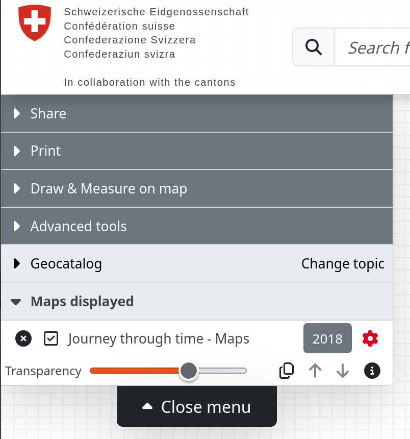
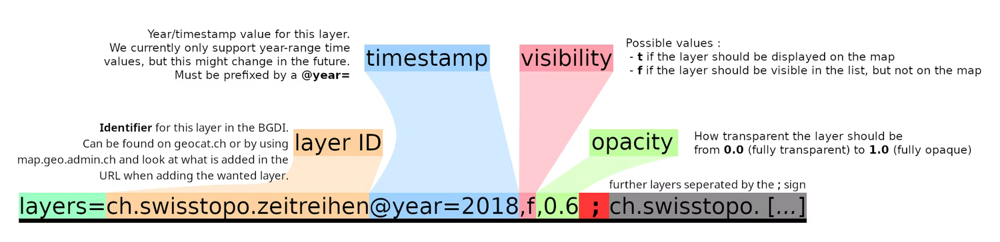

# URL Parameters

Adjust the parameters in the URL of the map viewer to have full control over what is shown on the map.
Use the URL to reproduce what you see right now on the map viewer anywhere.

## Introduction

The query string in the map viewer URL reflects what is currently displayed on the map.
The query string is the part of the URL after the question mark and is composed of key-value pairs like in this example:

```txt
https://map.geo.admin.ch/#/map?
   lang=en&
   center=2660000,1190000&
   z=1&
   topic=ech&
   layers=ch.swisstopo.swisstlm3d-wanderwege&
   bgLayer=ch.swisstopo.pixelkarte-farbe
```

These key-value pairs are the "URL parameters" we present in the following.

:::tip
The map viewer comes in two flavors:

- `https://map.geo.admin.ch/#/map`: The full-featured web map application that you see it on [map.geo.admin.ch](https://map.geo.admin.ch).

  <iframe src="https://map.geo.admin.ch/#/map?lang=en&center=2600992.01,1197480.32&z=6&topic=ech&layers=&bgLayer=ch.swisstopo.pixelkarte-farbe" style="border: 0;width: 400px;height: 300px;max-width: 100%;max-height: 100%;" allow="geolocation"></iframe>

- `https://map.geo.admin.ch/#/embed`: A simplified version with less menus suitable for embedding the map viewer on your webpage.
See [the tutorial about HTML iframes](/map-viewer/embed-in-an-iframe) for details.
  <iframe src="https://map.geo.admin.ch/#/embed?lang=en&center=2600992.01,1197480.32&z=6&topic=ech&layers=&bgLayer=ch.swisstopo.pixelkarte-farbe" style="border: 0;width: 400px;height: 300px;max-width: 100%;max-height: 100%;" allow="geolocation"></iframe>
:::

## Parameter Overview

A list of all URL parameters available at [map.geo.admin.ch](https://map.geo.admin.ch).

| Parameter      | Description                                                                                                                                                                                                                                                                                                           | Values                                                                                                            | Example                                                                                                                                              |
| -------------- | --------------------------------------------------------------------------------------------------------------------------------------------------------------------------------------------------------------------------------------------------------------------------------------------------------------------- | ----------------------------------------------------------------------------------------------------------------- | ---------------------------------------------------------------------------------------------------------------------------------------------------- | ------------------------- | -------------------------------------------------------------------------------------- |
| `lang`         | Language of the application                                                                                                                                                                                                                                                                                           | de, fr, it, rm, en                                                                                                | https://map.geo.admin.ch/#/map?lang=rm                                                                                                               |
| `z`            | Zoom level                                                                                                                                                                                                                                                                                                            | 0, 1, ..., 13                                                                                                     | https://map.geo.admin.ch/#/map?z=12                                                                                                                  |
| `center`       | Coordinates of center of the map view in LV95. The first value is the longitude-equivalent/easting, the second value is the latitude-equivalent/northing. The two are separated by a comma.                                                                                                                           | • Easting: between 2,450,000 and 2,900,000<br>• Northing: between 1,050,000 and 1,350,000                         | https://map.geo.admin.ch/#/map?center=2700000,1140000                                                                                                |
| `topic`        | Topic selected in the menu. Topics are groups of related datasets.                                                                                                                                                                                                                                                    | blw, are, bafu, swisstopo, kgs, funksender, nga, ivs, sachplan, geol, luftbilder, wildruhezonen, vu, inspire, ech | https://map.geo.admin.ch/#/map?topic=vu                                                                                                              |
| `bgLayer`      | Background layer                                                                                                                                                                                                                                                                                                      | ch.swisstopo.pixelkarte-farbe, ch.swisstopo.pixelkarte-grau, voidLayer                                            | https://map.geo.admin.ch/#/map?bgLayer=ch.swisstopo.pixelkarte-grau                                                                                  |
| `layers`       | The layers in use. Each layer can be configured, see [layer parameters](#layer-parameters) for details.                                                                                                                                                                                                               | See [layer parameters](#layer-parameters)                                                                         | https://map.geo.admin.ch/#/map?layers=WMS                                                                                                            | http://wms.geo.admin.ch/? | ch.swisstopo.geologie-geophysik-geothermie;ch.ensi.zonenplan-notfallschutz-kernanlagen |
| `timeSlider`   | Sets the year of the time slider. Format: `YYYY`, e.g. `1981`. Can be used with all "timeEnabled" levels. Special case WMS: An empty value (``timeSlider=`) means that the data for all years is displayed.                                                                                                           | 0000, 0001, ...., 9999                                                                                            | https://map.geo.admin.ch/#/map?layers=ch.swisstopo.lubis-luftbilder_farbe&timeSlider=1981                                                            |
| `crosshair`    | Describes the type, easting and northing of a crosshair that is drawn on the map.                                                                                                                                                                                                                                     | • Type: cross, circle, bowl, point, marker<br>• Easting/northing: see `center`                                    | (1) https://map.geo.admin.ch/#/map?center=2538700,1165890&z=6&crosshair=circle<br>(2) https://map.geo.admin.ch/#/map?crosshair=cross,2600981,1197448 |
| `swisssearch`  | A query sent to the service behind the search bar. The map viewer shows the search result as if you typed it into the search bar manually. <br>ℹ️ To center the map automatically on the first search result, use `&swisssearch_autoselect=true`, see also [the iframe documentation](/map-viewer/embed-in-an-iframe) | Any text                                                                                                          | (1) https://map.geo.admin.ch/#/map?swisssearch=berges%2037%20payerne<br>(2) https://map.geo.admin.ch/#/map?swisssearch=7.04983,46.42928              |
| `compareRatio` | The relative position of the swipe elements when comparison mode is enabled                                                                                                                                                                                                                                           | Floating point value between 0 and 1                                                                              | https://map.geo.admin.ch/#/map?compareRatio=0.5&bgLayer=ch.swisstopo.pixelkarte-farbe&layers=ch.swisstopo.geologie-generalkarte-ggk200               |
| `featureInfo`  | How to display the tooltip. More details in [the corresponding section](#tooltip).                                                                                                                                                                                                                                    | default, bottomPanel, tooltip, none                                                                               | https://map.geo.admin.ch/#/map?layers=ch.bav.haltestellen-oev@features=8500010&lang=fr&featureInfo=bottomPanel                                       |
| `geolocation`  | Whether to enable geolocation.                                                                                                                                                                                                                                                                                        | true, false                                                                                                       | https://map.geo.admin.ch/#/map?lang=fr&geolocation=true                                                                                              |
| `noSimpleZoom` | Whether the CTRL/CMD button must be pressed to zoom. This only takes effect in the [`embed` mode](#introduction).                                                                                                                                                                                                     | true, false                                                                                                       | https://map.geo.admin.ch/#/embed?&noSimpleZoom=true                                                                                                  |

## Layer Parameters

Layer parameters in query parameter `layers` describe which layers are chosen and how those layers are configured.

For example, a layer configuration in the map viewer that looks like this

{width=400px height=200px}

is represented by a `layers` query parameter like this:

```txt
layers=ch.swisstopo.zeitreihen@year=2018,t,0.6
       ╰──────────┬──────────╯╰───┬────╯╰┬╯╰┬╯
             identifier       timestamp  │  ╰ opacity
                                     visibility
```

where

- `identifier`: The "technical name" of the layer, for example `ch.swisstopo.zeitreihen`. You can find this identifier either in the URL when choosing the layer in the map viewer or through [geocat](https://www.geocat.ch). A full list of available layers can be listed by [the `/collections` endpoint of the STAC API](https://data.geo.admin.ch/api/stac/static/spec/v1/api.html#tag/Data/operation/getCollections).
- `timestamp`: Designates the version in time of the layer. Currently you can only select a version by year using the `@year=` prefix.
- `visibility`: `t` (or empty) for "true" if the layer is displayed on the map, `f` for "false" if the layer is listed in the menu but not displayed on the map
- `opacity`: The transparency of the layer. The value ranges from 0.0 (transparent) to 1.0 (opaque).

The layer parameters are separated by comma (`,`). You can have multiple layers by separating them with a semicolon (`;`).

As an illustration:



## Feature Selection

Center the map on a selected feature by using a special [layer parameter](#layer-parameters): `@features`.

For example, a map like this:

<iframe src="https://map.geo.admin.ch/#/embed?layers=ch.astra.unfaelle-personenschaeden_fahrraeder@features=769AE49DEC6D0106E0530A839427D480" style="border: 0;width: 688px;height: 300px;max-width: 100%;max-height: 100%;margin-top: 50px;" allow="geolocation"></iframe>

is represented by a URL like

https://map.geo.admin.ch/#/embed?layers=ch.astra.unfaelle-personenschaeden_fahrraeder@features=769AE49DEC6D0106E0530A839427D480

Multiple features are separated by a colon (`:`) like in this example

<iframe src="https://map.geo.admin.ch/#/embed?layers=ch.astra.unfaelle-personenschaeden_fahrraeder@features=203F7E8B2D110152E0630AB38B028D9D:769AE49DEC6D0106E0530A839427D480:98CDD8F6D5493E0BE05329B9D80AAB05" style="border: 0;width: 688px;height: 300px;max-width: 100%;max-height: 100%;margin-top: 50px;" allow="geolocation"></iframe>

with URL

https://map.geo.admin.ch/#/embed?layers=ch.astra.unfaelle-personenschaeden_fahrraeder@features=203F7E8B2D110152E0630AB38B028D9D:769AE49DEC6D0106E0530A839427D480:98CDD8F6D5493E0BE05329B9D80AAB05

## Tooltip

The query parameter `featureInfo` lets you choose from different options how to display a tooltip.
A tooltip is a text box with metadata that pops up when you select a feature in the map viewer.

The available options are:

- `default`: Places the tooltip in the default location most suitable for your device.
  For mobile devices, the default corresponds to option `bottomPanel`, for desktop the default is the floating `tooltip`.

  https://map.geo.admin.ch/#/embed?lang=en&center=2611363,1266310&z=9&bgLayer=ch.swisstopo.pixelkarte-farbe&topic=ech&layers=ch.bav.haltestellen-oev@features=8500010&featureInfo=default

- `bottomPanel`: Places the tooltip at the bottom of the map. This is the default location for mobile devices.

  https://map.geo.admin.ch/#/map?lang=en&center=2611363,1266310&z=9&bgLayer=ch.swisstopo.pixelkarte-farbe&topic=ech&layers=ch.bav.haltestellen-oev@features=8500010&featureInfo=bottomPanel

  <iframe src="https://map.geo.admin.ch/#/embed?lang=en&center=2611363,1266310&z=9&bgLayer=ch.swisstopo.pixelkarte-farbe&topic=ech&layers=ch.bav.haltestellen-oev@features=8500010&featureInfo=bottomPanel" style="border: 0;width: 688px;height: 300px;max-width: 100%;max-height: 100%;margin-top: 50px;" allow="geolocation"></iframe>

- `tooltip`: Places the tooltip over the map, as a floating element. This is the default behaviour on the desktop.

  https://map.geo.admin.ch/#/map?lang=en&center=2611363,1266310&z=9&bgLayer=ch.swisstopo.pixelkarte-farbe&topic=ech&layers=ch.bav.haltestellen-oev@features=8500010&featureInfo=tooltip

  <iframe src="https://map.geo.admin.ch/#/embed?lang=en&center=2611363,1266310&z=9&bgLayer=ch.swisstopo.pixelkarte-farbe&topic=ech&layers=ch.bav.haltestellen-oev@features=8500010&featureInfo=tooltip" style="border: 0;width: 688px;height: 300px;max-width: 100%;max-height: 100%;margin-top: 50px;" allow="geolocation"></iframe>

- `none`: The tooltip is hidden.

  https://map.geo.admin.ch/#/map?lang=en&center=2611363,1266310&z=9&bgLayer=ch.swisstopo.pixelkarte-farbe&topic=ech&layers=ch.bav.haltestellen-oev@features=8500010&featureInfo=none

  <iframe src="https://map.geo.admin.ch/#/embed?lang=en&center=2611363,1266310&z=9&bgLayer=ch.swisstopo.pixelkarte-farbe&topic=ech&layers=ch.bav.haltestellen-oev@features=8500010&featureInfo=none" style="border: 0;width: 688px;height: 300px;max-width: 100%;max-height: 100%;margin-top: 50px;" allow="geolocation"></iframe>
